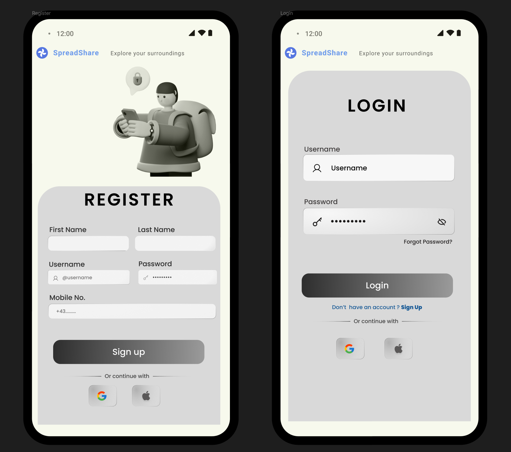
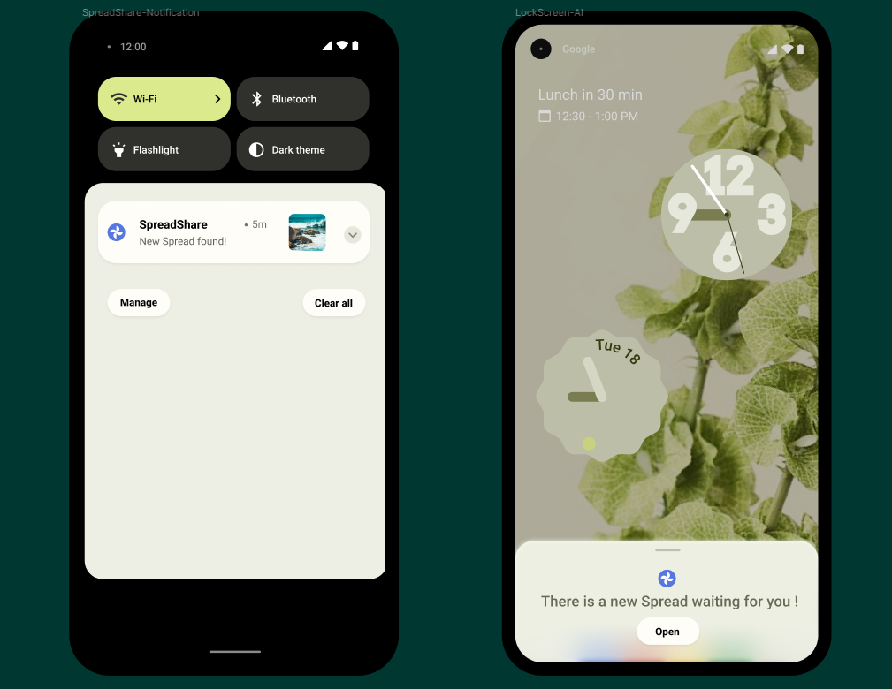
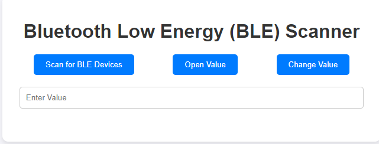
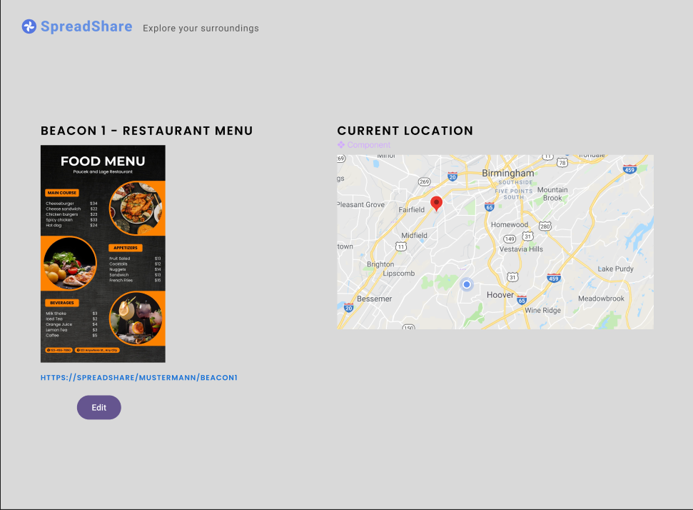

= Pflichtenheft SpreadShare
:toc: left
:sectnums:
:toclevels: 2
:table-caption:
:imagesdir: /images

Version: 1.1

Version Date: 21-09-2024

Authors:

* a.saydam@students.htl-leonding.ac.at
* f.stroschneider@students.htl-leonding.ac.at
* a.kurtic@students.htl-leonding.ac.at
* a.ignac@students.htl-leonding.ac.at

== Beschreibung der Ausgangslage

Viele Organisationen, politische Parteien, besonders während wichtiger Wahlkämpfe, verteilen Papierflyer mit den wichtigsten Informationen, wofür sie stehen. Werbungen, Flyer, Broschüren und Speisekarten in Restaurants sind nur einige Beispiele, die in Papierform verteilt werden. Die meisten Menschen nehmen diese ohne echtes Interesse an und entsorgen sie anschließend.

== Ist-Zustand

Die Papierverschwendung ist enorm. Bei Werbungen, Flyern, Broschüren und anderen Printmedien wird oft nicht auf die Umwelt geachtet. Die meisten Menschen werfen diese nach kurzer Zeit weg.

== Problemstellung

In der aktuellen Situation erhält jeder Passant einen Flyer, jedoch besteht nicht bei jedem Interesse, und die Printmedien werden an der nächsten „geeigneten“ Stelle entsorgt.

== Aufgabenstellung

=== Funktionale Anforderungen

Die Applikation soll auf Android (zzg. IOS) laufen. Dazu soll auch noch eine Website zu Verwaltung des Beacons erstellt werden. In der Applikation wird es zwei verschiedene Zugangsversionen geben, einmal für den Benutzer und einmal für den Beacon-Inhaber. Der Benutzer soll die Möglichkeit haben einzustellen ob die Applikation im Hintergrund läuft und damit auch die Benachrichtungen erhält ob ein Beacon in der Nähe ist. Falls der Benutzer die Benachrichtungen nicht erhalten möchte, kann er diese Einstellung deaktivieren. Dem Benutzer wird die Möglichkeit gegeben die erhaltenen Inhalte in seiner App zu Speichern. 

Formate wie PDF, JPG und PNG sollen unterstützt werden. Der Benutzer hat die Möglichkeit die Inhalte auch lokal zu speichern - Diese Option wird ihm vorgeschlagen.

Der Beacon-Inhaber wird die Möglichkeit haben, seinen Beacon entweder mit der Applikation oder der Website zu verwalten. Vorrausgesetzt wird das der Inhaber sich in der Nähe seines Beacons befindet. Mittels einer Drag&Drop Funktion soll dem Inhaber die erleichterte Verwaltung seines Beacons ermöglicht werden. Dem Inhaber soll auf einer Karte angezeigt werden wo sich ein Beacon befindet

=== Nicht-funktionale Anforderungen

* Sicherheitsanforderung
** Die Daten sollen vor Dritten geschützt werden.

* Zuverlässigkeit
** Das System soll, in einer vorhersehbaren und zuverlässigen Weise zu funktionieren.

* Benutzbarkeit
** Das System soll, so gestaltet werden, dass es einfach und intuitiv von Benutzern verwendet werden kann.

* Effizienz
** Das System soll die Ressourcen effizient nutzen.

* Übertragbarkeit
** Das System soll, auf andere Systeme oder Umgebungen übertragen werden können.

* Wartbarkeit
** Das System soll, Wartung- und Reparaturarbeiten in einfacher und schneller Weise durchführen können.

== Mockups

=== Index

.Index-Mockup
[%collapsible%open]
====
Incoming
====

=== Login & Register

.Login-, Register- Mockup
[%collapsible%open]
====

Zuerst wird der Login-Screen angezeigt. Durch das Ausfüllen der Pflichtfelder wird das Einloggen ermöglicht. Optional kann sich der Benutzer auch durch Klicken auf das Google- oder Apple-Logo einloggen. Mit dem Augensymbol kann das Passwort entweder angezeigt oder als „*“ dargestellt werden. Durch Betätigen von „Forgot Password?“ wird eine E-Mail mit einem Link verschickt, der es ermöglicht, das Passwort zu ändern.

Falls noch kein Account besteht, kann der Benutzer auf „Sign Up“ klicken und wird zur Registrierungsseite weitergeleitet. Hier müssen, wie im Login-Fenster, Daten angegeben werden, um sich registrieren zu können. Alternativ kann die Registrierung auch durch Klicken auf das Google- oder Apple-Logo erfolgen.
====

=== Notification

.Notification-Mockup
[%collapsible%open]
====

Falls sich ein Beacon in der Nähe befindet, wird eine Benachrichtigung an den Benutzer gesendet. Durch Klicken auf die Benachrichtigung wird der Benutzer zur Übersicht aller in der Nähe befindlichen Beacons weitergeleitet.
====

=== Scanner

.Scanner-Mockup
[%collapsible%open]
====

====

=== Location

.Location-Mockup
[%collapsible%open]
====

Durch Auswahl des Inhabers eines spezifischen Beacons kann dieser den Beacon bearbeiten. Auf der linken Seite befindet sich eine Vorschau des Inhalts, der sich derzeit auf dem Beacon befindet, sowie der darunter angezeigte Link, unter dem der Inhalt gespeichert ist. Durch Klicken auf den „Edit“-Button kann neuer Inhalt hochgeladen werden.

Auf der rechten Seite wird eine Karte angezeigt, die den aktuellen Standort des Beacons zeigt.
====

== Diagramme

.Use-case Diagramm
[%collapsible]
====
[plantuml, Usecasediagramme, png]
----
include::plantuml/Usecasediagramm.puml[]
----
====

== Zielsetzung

Den Verbrauch von Printmedien, Werbung, Flyern und Speisekarten zu minimieren und die Umwelt sauber zu halten.

== Projektplanung
link:Meilensteile.adoc[Meilensteine]

== Rahmenbedingungen

Programmiersprache: Kotlin

Framework: Angular

Betriebssystem: Android, IOS

BLE (Bluetooth Low Energy) Beacon / Esp32

Datenbank: PostgreSQL

== Administratives

----
Kontakt: a.saydam@students.htl-leonding.ac.at

Team: Saydam, Stroschneider, Kurtic und Ignac
----